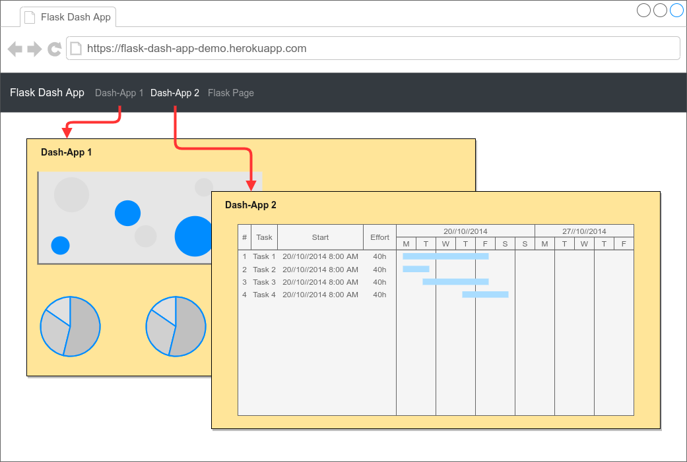

# Flask Dash App

!!Note: The default branch changed from `master` to `main`!!

See this [gist](https://gist.github.com/danieldogeanu/739f88ea5312aaa23180e162e3ae89ab) for information on how to follow up in your fork.

---

[Live demo](https://flask-dash-app-zcyc76b2aq-ey.a.run.app/) (be patient, runs on GCP Cloud Run without minimum instances hence cold start may take a few seconds)

---

This is a demo application that can serve as a starter project template.

- [Base image Python 3.11](https://github.com/tiangolo/uwsgi-nginx-flask-docker)
- [Plotly-Dash v2](https://dash.plotly.com/dash-2-0-migration)
- [Dash Bootstrap Components v1](https://dash-bootstrap-components.opensource.faculty.ai/migration-guide/)
- [Bootstrap 5](https://getbootstrap.com/)



It allows you to

- serve several individual Dash apps from a single Flask application,
- add core Flask logic, such as authentication with [Flask-Login](https://flask-login.readthedocs.io/en/latest/),
  generating assets with [Flask-Assets](https://flask-login.readthedocs.io/en/latest/), sending email
  with [Flask-Mail](https://pythonhosted.org/Flask-Mail/), etc.,
- integrate individual Dash apps in a global layout defined in Jinja templates.

## Overview

- [What's included](#whats-included)
- [Getting started](#getting-started)
  - [Integrate your Dash app](#integrate-your-dash-app)
- [Development](#development)
  - [VSCode devcontainer](#vscode-devcontainer)
  - [Dockerfile](#dockerfile)
- [Global layout: integration of individual dash apps](#global-layout-integration-of-individual-dash-apps)
- [Credits](#credits)
- [License](#license)

## What's included

Docker base image:
[https://github.com/tiangolo/uwsgi-nginx-flask-docker](https://github.com/tiangolo/uwsgi-nginx-flask-docker)

- [Bootstrap 5](https://getbootstrap.com/)
- [Dash Bootstrap Components](https://dash-bootstrap-components.opensource.faculty.ai/)

## Getting started

```
git clone https://github.com/tzelleke/flask-dash-app.git
cd flask-dash-app
cp .env.example .env
docker compose up -d
```

### Integrate your Dash app

Let us go through the steps to integrate a simple demo Dash app. Here is the source code for a rudimentary Dash app.

```python
import dash
import dash_html_components as html

app = dash.Dash(__name__)

app.layout = html.Div(children=[html.H1(children="Hello Dash"), ])

if __name__ == "__main__":
    app.run_server(debug=True)
```

Save it as `demo.py` in the `app/dash/` folder.

Change the code in `demo.py` to:

```python
from .dash import Dash
import dash_html_components as html

app_layout = html.Div(children=[html.H1(children="Hello Dash"), ])


def init_dash(server):
    dash_app = Dash(server=server, routes_pathname_prefix="/demo/", )
    dash_app.layout = app_layout
    return dash_app.server


if __name__ == "__main__":
    app = Dash(__name__)
    app.run_server(debug=True)
```

Register the Dash app with the main Flask application in `app/main.py`.

```python
...
with app.app_context():
    from .dash import demo

    app = demo.init_dash(app)
...
```

Add the new route to the global navbar in `app/templates/partials/navbar.html`

```html
...
<a class="dropdown-item" href="/demo/">Simple Demo</a>
...
```

## Development

Manage python dependencies (using [Poetry](https://python-poetry.org/docs/))

```shell
docker compose run app poetry update # ... or any other poetry command
```

### VSCode devcontainer

This project includes a [devcontainer](https://code.visualstudio.com/docs/devcontainers/containers) configuration for VSCode.
This allows you to develop inside a container with all the necessary dependencies installed.
See the `.devcontainer` and `.vscode` folders for details.

To ease development inside the devcontainer, the `dev` stage of the multi-stage `Dockerfile` adds an sudo-enabled user `app`.
You can adapt the user id and group id in the `Dockerfile` to match your local user id and group id.

The devcontainer does not start the Flask server automatically.
You have to start the Flask server manually, ie. issue `flask run` in a terminal.

### Dockerfile

Here is a brief overview of the multi-stage `Dockerfile` with the available build arguments and some explanations:

```dockerfile
ARG PYTHON_VERSION=3.11
ARG POETRY_VERSION=1.6
ARG UID=1000
ARG GID=1000
ARG USER=app

FROM tiangolo/uwsgi-nginx-flask:python${PYTHON_VERSION} as base
...

FROM base as poetry
...

FROM poetry as dev
# add sudo-enabled user
...

FROM base as prod
# does not include Poetry dependencies
...
```

## Global layout: integration of individual dash apps

This starter integrates individual dash apps into a global layout provided by Flask/Jinja templates. This is achieved by
overriding the `interpolate_index` method from the core `Dash` class.

```python
# app/dash/dash.py
import dash
from markupsafe import Markup
from flask import render_template


class Dash(dash.Dash):
    def interpolate_index(
        self,
        metas="",
        title="",
        css="",
        config="",
        scripts="",
        app_entry="",
        favicon="",
        renderer="",
    ):
        return render_template(
            "dash.html",
            metas=Markup(metas),
            css=Markup(css),
            dash_config=Markup(config),
            scripts=Markup(scripts),
            app_entry=Markup(app_entry),
            renderer=Markup(renderer),
        )
```

**Note:** `markupsafe.Markup` is used to prevent Jinja from escaping the Dash-rendered markup.<br />
**Note:** `config` is mapped to `dash_config` to avoid shadowing the global Flask config in the Jinja environment.

The corresponding Jinja template in `app/templates/dash.html` extends the base template and injects the provided markup
via Jinja [template blocks](https://jinja.palletsprojects.com/en/3.0.x/templates/#template-inheritance).

```
{# app/templates/dash.html #}


  {{ super() }}
  {{ metas }}


  {{ super() }}
  {{ css }}


  {{ app_entry }}


  {{ super() }}
  {{ dash_config }}
  {{ scripts }}
  {{ renderer }}

```

## Credits

- [https://hackersandslackers.com/plotly-dash-with-flask/](https://hackersandslackers.com/plotly-dash-with-flask/)
- [https://github.com/tiangolo/uwsgi-nginx-flask-docker](https://github.com/tiangolo/uwsgi-nginx-flask-docker)
- [https://www.merixstudio.com/blog/deploying-docker-heroku-tutorial/](https://www.merixstudio.com/blog/deploying-docker-heroku-tutorial/)

## License

See the [LICENSE](https://github.com/tzelleke/flask-dash-app/blob/master/LICENSE.md) file for license rights and
limitations (MIT).
